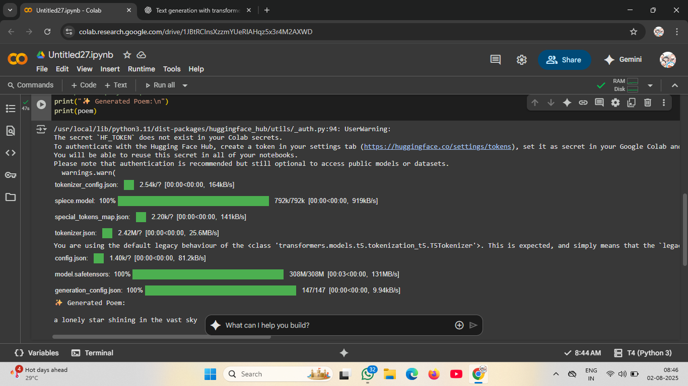

# 🌌 Poetry Generator using FLAN-T5 (Text-to-Text Generation)



## 📖 Abstract

This project demonstrates a simple implementation of **text-to-text generation** using a **foundation model** (FLAN-T5-small) from the Hugging Face `transformers` library. The core objective of this tool is to **generate poetry** based on a given topic, allowing users to explore creative text generation using modern **generative AI techniques** — without relying on any external APIs.

The model is loaded locally and run entirely within a Google Colab environment or any machine with the necessary dependencies installed. It uses `T5ForConditionalGeneration` to generate coherent and context-aware poetic lines based on prompts such as *"a lonely star shining in the vast sky."*

Key features include:
- Use of a **foundation model** (FLAN-T5-small)
- **No API key or internet-dependent generation** after download
- Simple and elegant output tailored for creative use cases like poetry, storytelling, or education

This project can be extended into larger creative applications, including story writers, fantasy name generators, emotional rephrasers, or personalized educational tools.

---

## 🚀 How to Run

1. Clone this repo or open the `.ipynb` in [Google Colab](https://colab.research.google.com/).
2. Install dependencies:
    ```bash
    pip install transformers sentencepiece
    ```
3. Run the notebook and enter your desired input prompt.
4. Enjoy your AI-generated poetry!

---

## 🧠 Example Prompt

```python
input_text = "a lonely star shining in the vast sky"
